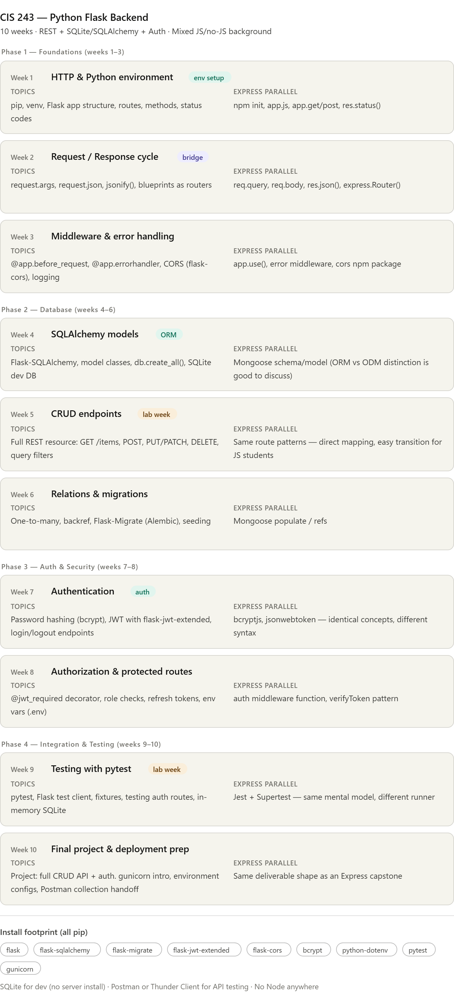

Here's a 10-week syllabus mapping Flask to Express patterns, accounting for mixed-background students:A few notes worth calling out:

**For mixed-background students** — weeks 1–3 include explicit Express parallels in every lesson. JS students can anchor on what they know; students with no backend background learn Flask without the cognitive overhead of comparing two languages.

**SQLite choice** — no Postgres install needed, no IT friction, and SQLAlchemy makes swapping to Postgres a one-line config change later.

**Week 3 pacing** — middleware/error handling is where non-JS students typically struggle. Consider making this a two-part week (lecture + dedicated lab day) if your schedule allows.

**Testing in week 9** — pytest + Flask test client is significantly cleaner than Jest/Supertest for beginners. Selling point if students are skeptical: less boilerplate, readable assertions, no async complications.

Want me to draft the Week 1 lesson outline or a starter project scaffold?